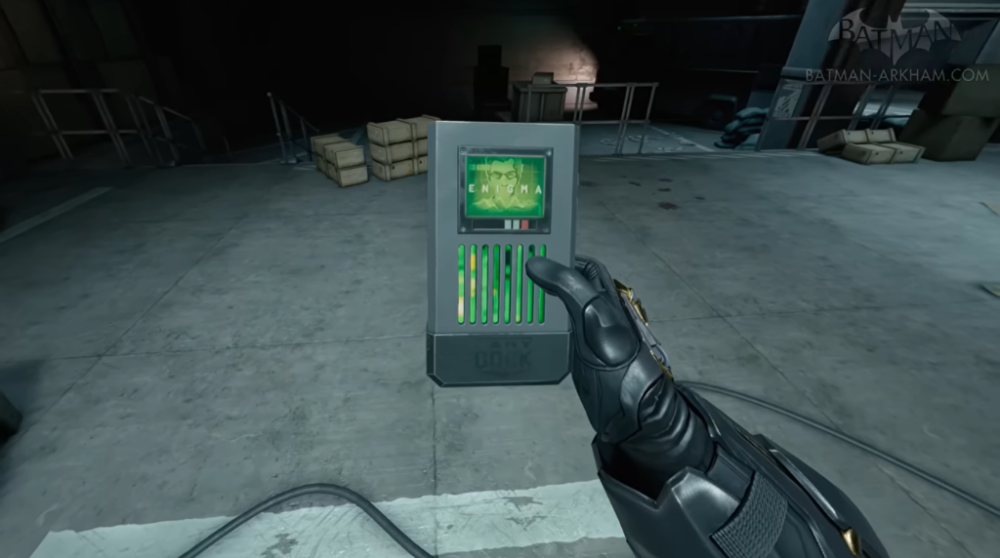

# Enigma Data Pack - Robin: Origins

A functional custom electronic prop for the indie fan film *"Robin: Origins"*. The design is based on the iconic Enigma Data Packs from the Batman *Arkham* universe, engineered as an interactive gadget that can be carried on set and connected to a PC via USB-C to mount as an encrypted data drive.

---

## Hardware Versions

The project contains two distinct hardware designs:

1. **Mini Version (Movie Prop - In Production):** An ultra-compact, stunt-safe, pocket-sized tactical drive (~85 × 57 × 12 mm, inspired by rugged portable SSDs like the Samsung T7 Shield). Tailored specifically for the film's action scenes and PC terminal connection.
2. **Full-Size Replica Version:** A heavy, 1:1 scale Arkham military cartridge featuring dual active 40mm cooling fans, internal LiPo battery charging, and full power-rail boost converters.

---

### 1. Mini Version (Movie Hero Prop)
> Located in: [`PCB/Mini Version/Riddler-Datapack mini/`](PCB/Mini%20Version/Riddler-Datapack%20mini/)

Optimized for durability, pocket portability during physical stunt chases, and reliable on-set PC docking:

* **Form Factor:** Compact 60 × 45 mm PCB inside an ~85 × 57 mm enclosure with chamfered `PCIe NVMe` nose cone and front grille vents.
* **Microcontroller:** ESP32-S3-MINI-1 (dual-core, native USB OTG, onboard PCB antenna).
* **Power Architecture:** Purely bus-powered via USB-C (5V VBUS). High-efficiency TLV62568 synchronous step-down buck converter supplies 3.3V @ up to 1A. No internal LiPo batteries required on set, eliminating safety risks and battery downtime.
* **Storage:** MicroSD card socket wired via high-speed **4-bit SDMMC** with hardware pull-ups (4.7kΩ) for fast read/write speeds when mounted as a USB Mass Storage (MSC) drive.
* **Display:** 1.14" IPS TFT LCD (ST7789, 240×135) for crisp "ENIGMA" animations and boot terminals.
* **Illumination:** Integrated addressable RGB LEDs (WS2812B / SK6812) projecting the signature neon green glow through the front casing grille.
* **Protection:** Dedicated USBLC6-2P6 ESD protection on high-speed USB data lines and reverse-polarity Schottky diode on VBUS.

---

### 2. Full-Size Replica Version
> Located in: [`PCB/Riddler-Datapack/`](PCB/Riddler-Datapack/)  
> Full schematic export: [Riddler-Datapack_v0p5.pdf](docs/circuit%20diagrams/Riddler-Datapack_v0p5.pdf)

The full-scale desktop/showcase replica with complete internal subsystem autonomy:

* **Microcontroller:** ESP32-S3-WROOM-1U.
* **Active Cooling:** Dual 40x40mm cooling fans with independent PWM speed control.
* **Power Management:**
  * BQ25170DSGR standalone linear LiPo battery charger (chargeable via USB-C).
  * TPS61023 5V boost converter for fans and high-brightness LED arrays.
  * TLV62568DBV 3.3V buck regulator for MCU logic.
* **Level Shifting:** SN74AHCT125 / 74AHCT1G125 high-speed logic level shifting for 5V LED data lines.
* **Controls:** Physical rocker power switch (`1 / 0`) and dual fan headers.

---

## Visual Reference & In-Game Footage

| Front View (Idle / Off) | Front View (Active "ENIGMA" Display & LEDs) |
| :---: | :---: |
|  |  |

| Top Fans & Lighting | Side Controls & Switch | Bottom Dock ("D-PCK 54") |
| :---: | :---: | :---: |
|  |  |  |

---

## Sources & Credits

* **Concept Art:** [Arkham City Fandom - Enigma Datapack](https://arkhamcity.fandom.com/wiki/Enigma_Datapack?file=Bao-enigma-data-pack.jpg)
* **Video Game Screenshots & Footage:** [Batman Arkham - Enigma Datapacks Gameplay Footage (YouTube)](https://www.youtube.com/watch?v=1w_udK2QxwU)

---

## License
The software/firmware in the `Firmware` directory is licensed under the GNU General Public License v3.0 (GPLv3).

The hardware design files in the `PCB` directory are licensed under the CERN Open Hardware Licence Version 2 - Strongly Reciprocal (CERN-OHL-S).