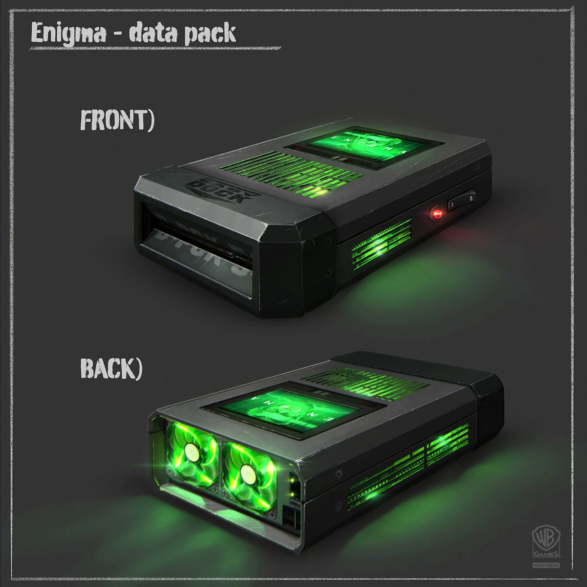
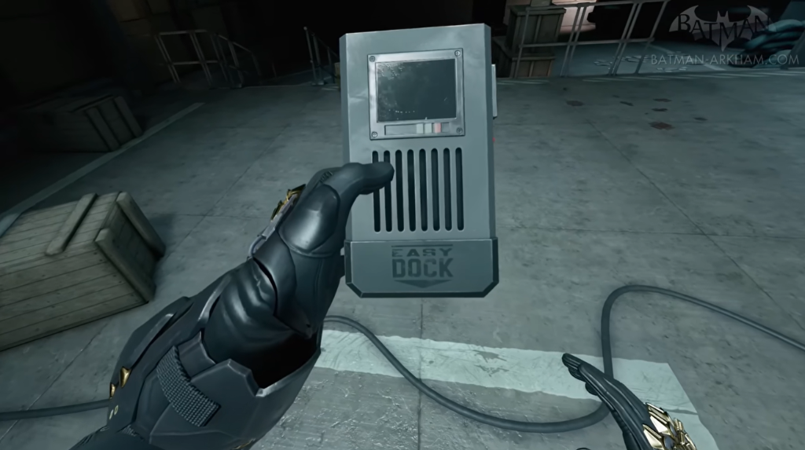
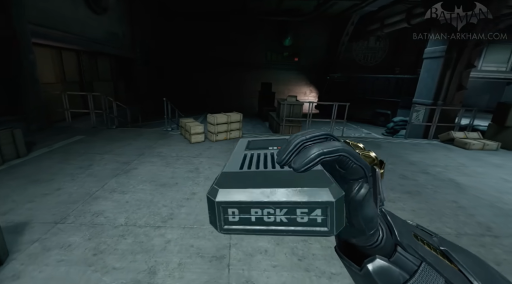
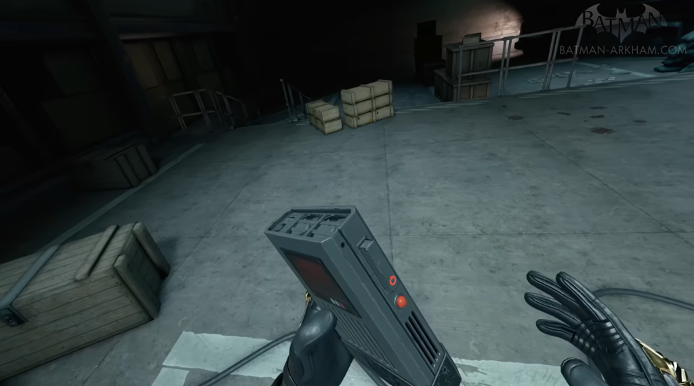
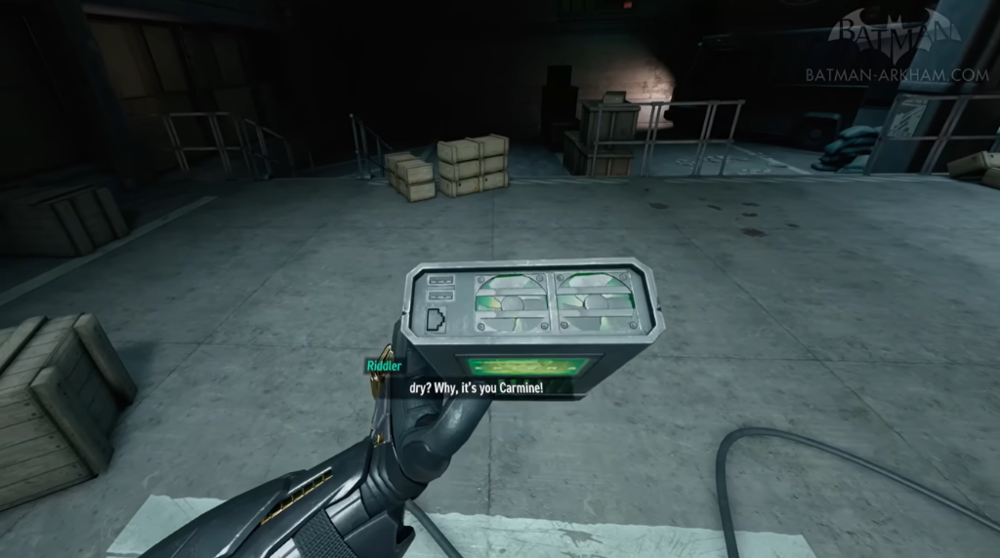

# Enigma Data Pack - Robin: Origins

A functional custom PCB for a film prop in the fan film "Robin: Origins". The design is based on the Enigma Data Packs from the Arkham universe and serves as an interactive gadget that can be used on set and physically connected to a PC.

## Features

* **USB Mass Storage:** The microcontroller natively registers as a USB drive on a PC via USB-C to provide files and data.
* **Display:** Controls a TFT LCD for "ENIGMA" animations on the top surface.
* **Fans & Lighting:** PWM control for two 40x40mm fans and control of the integrated WS2812B RGB LEDs for the signature green glow.
* **Battery Powered:** Integrated LiPo charge management (via USB-C) with a physical main power switch.

## Hardware Specifications

* **Microcontroller:** ESP32-S3-WROOM-1U
* **Power Management:** 
  * BQ25170DSGR (LiPo charger)
  * TLV62568DBV (3.3V step-down for the ESP32)
  * TPS61023 (5V boost converter for fans and LEDs)
* **Level Shifting:** SN74AHCT125 / 74AHCT1G125 (for a clean WS2812 data signal with 5V logic levels)
* **Peripherals:** 
  * USB-C Female (Data & Power)
  * 2x 4-Pin Headers (5V, GND, PWM, WS2812-Data) for fan connections

## Visual Reference & In-Game Footage

| Front View | Bottom View ("D-PCK 54") |
| :---: | :---: |
|  |  |
| **Side Controls** | **Top Fans & Lighting** |
|  |  |

## Sources & Credits

* **Concept Art:** [Arkham City Fandom - Enigma Datapack](https://arkhamcity.fandom.com/wiki/Enigma_Datapack?file=Bao-enigma-data-pack.jpg)
* **Video Game Screenshots & Footage:** [Batman Arkham - Enigma Datapacks Gameplay Footage (YouTube)](https://www.youtube.com/watch?v=1w_udK2QxwU)

## License
The software/firmware in the [Firmware] directory is licensed under the GNU General Public License v3.0 (GPLv3).

The hardware design files in the [PCB] directory are licensed under the CERN Open Hardware Licence Version 2 - Strongly Reciprocal (CERN-OHL-S).